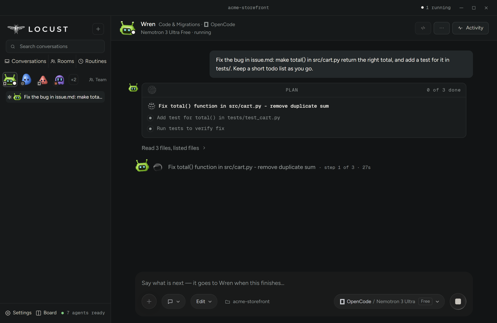
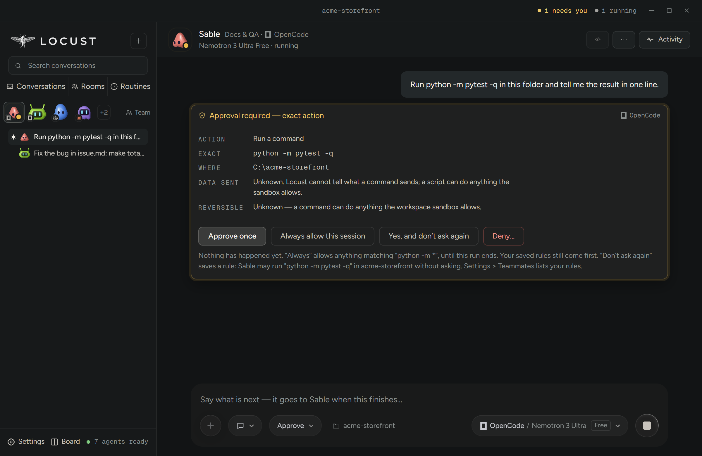
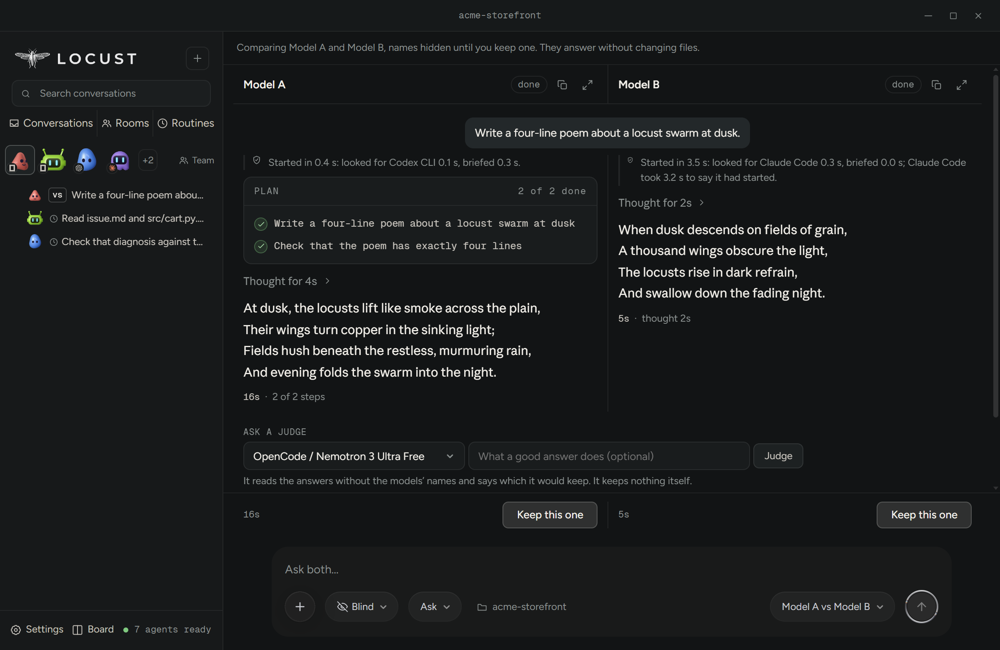

# Locust

Locust runs AI coding teammates against a folder on your machine. You choose
the runtime, the model, and how much each teammate is allowed to do — and you
bring your own accounts, keys or free tiers. It resells nobody's tokens.

It drives the coding agents you already use: **Claude Code, Codex, Cursor,
GitHub Copilot, OpenCode, Antigravity and Muse Code**, each on the models its
own CLI offers.

This repository carries the installers and the update feed. The source is
[automatedworkflowllc-design/locust-app](https://github.com/automatedworkflowllc-design/locust-app)
(MIT), a mirror exported from development at each release.
**[Issues here](https://github.com/automatedworkflowllc-design/locust-releases/issues)
are the right place for bugs and questions.**

<table>
<tr>
<td> Your team of six, each teammate on its own AI and model. Connected accounts: 7 ready.</td>
<td> One picker for the models your own accounts offer, grouped by agent, with the one in use marked.</td>
</tr>
<tr>
<td> A run in progress: a three-step plan, step 1 under way, the live line naming the step and its time.</td>
<td> Approve each: before a command runs you see the exact command, where it runs, and what Locust can and cannot tell about it.</td>
</tr>
<tr>
<td> A hand-off chain: Wren (OpenCode) diagnosed the bug; Atlas (Codex) read the code himself and wrote VERDICT: APPROVED.</td>
<td> The finished fix: 2 files edited, a test added, four tests passing, in 1m 01s.</td>
</tr>
<tr>
<td> Blind compare: two models on the same ask, names hidden until you keep one. A judge model can be asked which it would keep.</td>
<td> The Board: every conversation by what it needs from you.</td>
</tr>
</table>

Screenshots from Locust 0.619.0 on a fresh demo profile: real runs, no mocks. The models shown are what that machine’s accounts offer; yours come from your own accounts.

## What a teammate is

A teammate is a name, a role and a route — a runtime and a model you picked.
Give one a folder and a job and it works there, and the whole run is written
to a local ledger you can reopen.

They are not separate chat windows. A teammate can hand work to another one
by name, and the reply comes back into the conversation that asked; each
answers on its own route, so you can put two models on the same problem and
see both. A **Chief of Staff** takes what you asked for, gives it to the
teammate whose role fits, and reports back in one message. Conversations can
be grouped, and a group's standing instructions brief every turn from the
moment you put a conversation in it.

A **hand-off chain** is a routine whose steps go to different teammates, each
on its own runtime, with a checker that must approve before the run counts.
Each runtime's own `/` commands are in the menu (Claude Code, OpenCode, Codex),
`@` attaches a project file, and up to eight runs can go at once.

**Compare** gives one task to two or three models side by side, each in its
own copy of the folder, or blind with the names hidden until you pick; keep the
one you like. ([Three models building the same game, blind](https://locust.lol/arena/).)
**The Board** shows every conversation in columns by what it needs from you,
across every runtime at once. **Routines** run a teammate on a schedule, or when
files in a folder change, and can keep going after the window is closed.

Deleting a conversation is undoable — the record waits in **Settings → Trash**
until you empty it.

## Install

Download **`Locust-Setup.exe`** from the
[latest release](https://github.com/automatedworkflowllc-design/locust-releases/releases/latest)
and run it. That name is version-stable and always the newest build, which is
what [locust.lol](https://locust.lol) links; the `Locust-<version>-setup.exe`
beside it is the same bytes under a name that says which build it is.

**Windows x64** gets every release. **macOS** (Apple silicon and Intel,
`Locust-<version>-mac-arm64.dmg` / `-mac-x64.dmg`) gets a build every few
releases, so the newest Mac build can trail Windows; locust.lol always offers
the newest one there is and says when it is older. Linux is not published.

The build is **unsigned**. Windows SmartScreen will show a blue *"Windows
protected your PC"* panel the first time — choose **More info → Run anyway**.
Signing is deliberately not set up for a pre-release, so expect that warning
on every fresh install until it is. On a Mac the build is not signed by Apple
either: the first open asks you to allow it, in **System Settings → Privacy &
Security → Open Anyway**.

## What you need besides the app

Locust drives coding CLIs; it does not bundle one. On first launch it shows
which CLIs are already on your machine and offers to install the ones that are
not. It carries its own npm for that, so you do not need Node.js installed.
(A first install on a machine that has never had Node has not yet been tested
from scratch; if it fails for you, please file it.)

The model itself still comes from somewhere you control: your own
subscription, an API key, or a provider's free tier. "Free" here means a free
tier or a local model. It never means unmetered access to a paid plan.

## Updates

The app asks this repository for the latest release when it launches and
installs the update when you quit. A Mac copy updates itself too. `latest.yml` is the feed it reads; the
installer and its blockmap sit beside it in every release. Each release's
notes say what changed.

## Status

Pre-release, and it behaves like one. It is being tested in the open, and the
release notes are written to be honest about what is fixed and what is not.
If something is wrong, please file it — a report from someone who was not
expecting the bug is worth more than any amount of self-testing. The app's **Send
feedback** box fills in your version and system for you, and can open the
issue here or save the whole report as a file to attach. For anything you'd
rather not post publicly, email **support@locust.lol**.
